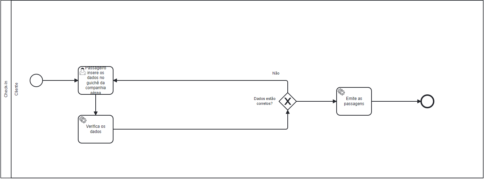
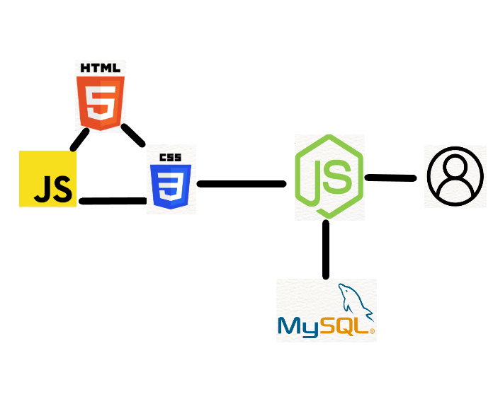
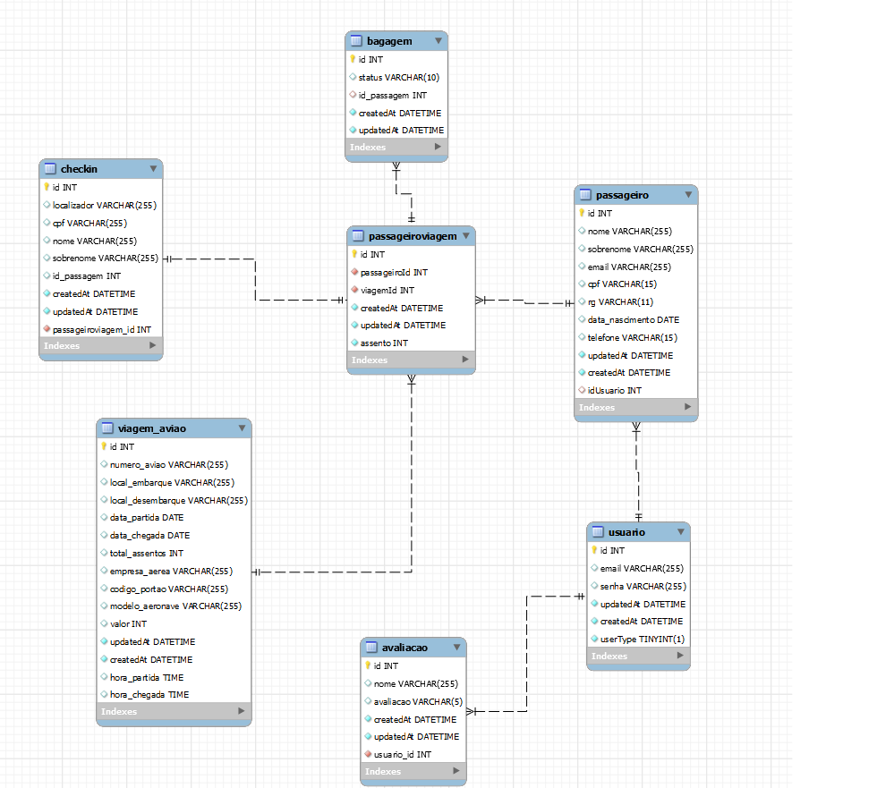

# AIR INFO 

**Pedro Henrique Moreira Caixeta Ferreira, pedro.caixeta@sga.pucminas.br**

**Lucas Hemétrio Teixeira, lucas.hemetrio@sga.pucminas.br**

**Lucca Oliveira Vasconcelos de Faria, lovfaria@sga.pucminas.br**

**Lucas Flor Vilela, lucas.flor@sga.pucminas.br**

**Daniel Nicesio Campos, daniel.campos.1380773@sga.pucminas.br**

---

Professores:

**Hugo Bastos de Paula**

**Eveline Alonso Veloso**

---

_Curso de Engenharia de Software, Unidade Praça da Liberdade_

_Instituto de Informática e Ciências Exatas – Pontifícia Universidade de Minas Gerais (PUC MINAS), Belo Horizonte – MG – Brasil_

---

O sistema Dinâmica de Aeroporto foi criado com o intuito de trazer uma solução eficaz para ajudar pessoas que enfrentam problemas durante viagens aéreas. Como o processo de viajar de avião pode ser bastante complexo, desde a compra de passagens até o embarque no avião, ao entrar no sistema, o usuário terá acesso a informações sobre o horário do voo e instruções sobre o que deve fazer no aeroporto. Dessa forma, os procedimentos são simplificados e as preocupações dos passageiros serão reduzidas.

---

## 1. Introdução

## 1.1 Contextualização

   Todos sabemos que viajar de avião pode nos trazer praticidade, porém muitas vezes essa praticidade pode se tornar problemática, 
para ser mais exato em 2022 mais de 5,2 milhões de pessoas tiveram problemas com seus voos, o que significa que 1 a cada 7 pessoas 
sofrem por não ter muitas informaçãoes do voo, não sabemos onde é nosso embarque, como esta organizado os comissários 
de bordo, porém alguns desses problemas podem ser resolvidos.

## 1.2 Problema
    
   O principal desafio enfrentado pelos passageiros é a dificuldade em encontrar uma plataforma que integre todos os processos envolvidos em uma viagem de avião. Muitas vezes, os usuários encontram problemas ao comprar passagens, obter informações sobre o voo, fazer o check-in de forma simples, encontrar meios de transporte para chegar ao aeroporto ou se deslocar no destino, obter atualizações sobre o status da bagagem e receber assistência nos aeroportos para encontrar o portão de embarque e entender como será realizado o processo de conexão ou escala. Tudo isso pode gerar muita confusão e desperdício de tempo para os passageiros.

## 1.3 Objetivo geral
    
O trabalho apresentado tem por objetivo a criação de um site destinado à aeroportos e seus clientes, automatizando processos desde a compra da passagem até a obtenção de informações do voo desejado.

 ### 1.3.1 Objetivos específicos
        
 Alguns objetivos específicos que serão tratados são:
 - Atualização do status dos voos (atrasado, cancelado, no horário previsto)
 - Automatização do check-in online
 - Automatização da compra da passagem

## 1.4 Justificativas

Todos sabemos o stress na hora de viajar de avião, documentos necessarios, check-in, despachar bagagem, preocupação se o voo será cancelado ou está atrasado, etc. Este projeto teve início com a ideia de facilitar todo este processo, da chegada ao aeroporto à saída do aeroporto do destino final, para o usuário que vai fazer uma viagem sozinho ou com amigos. Check-in, portão de embarque, status do voo, traslados do aeroporto, todas essas informações diretamento no celular com o intuito de otimizar o tempo do usuário para que ele faça uma viagem mais tranquila.
    

## 2. Participantes do processo

    Sistema de dinâmica de aeroporto

- Cliente: participa do processo escolhendo seu destino, comprando sua passagem, fazendo check-in, pega suas malas no destino e finaliza o processo.

- Empresa aérea: participa do processo fornecendo opções de destino para o cliente, transporta o cliente entre seus destinos.

- Funcionários do aeroporto: participam do processo realizando o check-in do cliente (passageiro), despachando as malas do mesmo e realizando a manutenção do avião.

## 3. Modelagem do processo de negócio

## 3.1. Análise da situação atual

Atualmente os processos sobre voos são tratados tanto presencialmente nos aeroportos como pela internet. Existem sites de venda de passagem como decolar, 123milhas e das próprias empresas aéreas, que também oferecem check-ins automatizados, cartões de embarque online e compra de bagagem. Além disso, existem sites de aeroportos que trazem informações sobre os voos e transportes até o aeroporto, como por exemplo a Conexão Aeroporto aqui em Belo Horizonte.

Já dentro do aeroporto passagens podem ser compradas em quiosques das companhia aéreas, o check-in pode ser feito de forma rápida em totens ou com os atendentes caso deva despachar bagagem. Informações sobre o voo, como, horário de embarque, portão, e status, podem ser visualizados em televisores colocados na sala de embarque. 

Dessa forma, pela informação estar espalhada em vários lugares, a experiência do cliente pode ser tornar mais cansativa por não ter uma plataforma central que acomode todas informações dos voos, aeroportos e transportes.

## 3.2. Descrição Geral da proposta 

Na nossa sociedade é possível avaliar que os viajantes possuem muitos problemas em relação as suas viagens, assim podendo atrapalhar na questão do tempo ou até mesmo a perda do voo/viagem.

A ferramenta irá proporcionar ao passageiro de forma completa, todos os passos desde a compra da passagem aérea até a chegada no destino final.

Cada processo será descrito como:

Compra de passagens áreas: O usuário vai escolher as datas da viagem juntamente com a companhia área e irá selecionar qual trajeto irá atender melhor às necessidades do passageiro.

Gerenciar dados do voo: Nesse processo irá possibilitar cadastrar todas das informações/dados do voo onde o passageiro poderá se organizar. Também irá auxiliar o passageiro durante sua locomoção dentro do aeroporto para saber o portão de embarque e depois dentro do avião se seu voo possui escalas ou conexão, com isso podendo ser auxiliado da melhor forma.

Check-in: Parte do processo onde o usuário irá escolher os lugares dentro do avião, vai despachar suas bagagens se necessário e emitir os bilhetes.

Status de bagagens: Processo onde o passageiro irá receber informações do status da bagagem, se ela chegou bem no destino, se houve alguma violação ou extravio. 

Estes processos ajudarão na organização do passageiro e flexibilizará o tempo dos mesmos.

## 3.3. Modelagem dos Processos

### 3.3.1 Processo 1 – Compra da passagem
Neste processo irá ser apresentado o fluxo onde o cliente efetua ou não a compra da passagem, além de mostrar por parte da empresa desde a criação da passagem até o envio da passagem para o cliente por email.

### 3.3.2 Processo 2 – Check-In

O diagrama a seguir apresenta o processo de realização de Check-in. Onde o passageiro irá escolher os lugares dentro do avião.

Nesse processo sera descrito como irá funcioanr o processo de Check-In do viajante, onde o mesmo ira realizar como se fosse do formato online ou presencialmente no 
areoporto.

### 3.3.3 Processo 3 – Status das bagagens

Os diagrama a seguir apresentam os processos de status das bagagens. Que irão mostrar um passo a passo do que está acontecendo com a bagagem e onde ela se encontra.

### 3.3.3.1 - Despache de bagagens
      
O diagrama a seguir apresenta o processo de despachar bagagens.

### 3.3.3.2 - Destino das bagagens
      
O diagrama a seguir apresenta como a bagagem é destinada.

### 3.3.3.3 - Inspeção das bagagens
      
O diagrama a seguir apresenta como a bagagem é inspecionada.

### 3.3.3.4 - Retirada das bagagens
      
O diagrama a seguir apresenta como a bagagem é retirada.

### 3.3.4 Processo 4
### 3.3.4.1- Avaliação geral do site

O diagrama a seguir apresenta o processo de avaliação do site pelos usuários.

### 3.3.5 Processo 5 - Gerenciar dados de voo
### 3.3.5.1 - Apresentação de dados do voo

Processo em qual o cliente confere os dados do seu voo, que estão armazenados no banco de dados.

### 3.3.5.2 - Atualização de dados do voo

Processo em qual o funcionario do aeroporto verifica o status do voo e atualiza a informação.

## 4. Projeto da Solução

### 4.1. Detalhamento das atividades

Descrever aqui cada uma das propriedades das atividades de cada um dos processos. Devem estar relacionadas com o modelo de processo apresentado anteriormente.

#### Processo 1 – Compra da Passagem

**Escolhe Destino e Data**

| **Campo** | **Tipo** | **Restrições** | **Valor default** |
| --- | --- | --- | --- |
| Local de Partida | Caixa de texto | Local Já Registrado |  |
| Destino | Caixa de texto | Local Já Registrado |  |
| Data de Partida | Data | Formato Dia/Mês/Ano |  |
| Data de Volta | Data | Formato Dia/Mês/Ano |  |

**Escolhe Passagem**

| **Campo** | **Tipo** | **Restrições** | **Valor default** |
| --- | --- | --- | --- |
| Passagens | Seleção única |  |  |

**Escolhe Assento**

| **Campo** | **Tipo** | **Restrições** | **Valor default** |
| --- | --- | --- | --- |
| Numero do Assento | Seleção única |  |  |

**Insere Dados do Passageiro**

| **Campo** | **Tipo** | **Restrições** | **Valor default** |
| --- | --- | --- | --- |
| Nome | Caixa de Texto |  |  |
| CPF | Número | Deve ter 11 digitos |  |

**Insere Dados Pagamento**

| **Campo** | **Tipo** | **Restrições** | **Valor default** |
| --- | --- | --- | --- |
| Nome Passagiero | Caixa de Texto |  |  |
| Sobrenome Passageiro | Caixa de Texto |  |  |
| E-mail | Caixa de Texto | Formato de E-mail |  |
| CPF Titular | Número | 11 Digitos |  |
| Documento Passagiero | Número | 10 a 11 Digitos |  |
| Data de Nascimento | Data | Formato Dia/Mês/Ano |  |
| Telefone | Número | Formato de Telefone Celular |  |
| Número do Cartão | Número | 16 Digitos |  |
| CVV do Cartão | Número | Deve ter 3 Digitos |  |
| Validade do Cartão | Data | Formato Mês/Ano |  |
| Nome Titular Cartão | Caixa de Texto |  |  |

#### Processo 2 – Check-In

**Realização do Check-In**

| **Campo** | **Tipo** | **Restrições** | **Valor default** |
| --- | --- | --- | --- |
| CPF | Caixa de texto | Formato de CPF com 11 digitos |  |
| Nome | Caixa de texto |  |  |
| Sobrenome | Caixa de texto |  |  |
| ID da passagem | Caixa de texto |  |  |

**Escolher lugares**

| **Campo** | **Tipo** | **Restrições** | **Valor default** |
| --- | --- | --- | --- |
| Assentos | Seleção única | Dropbox com lugares disponiveis |  |

#### Processo 3 – Situação das bagagens

**Despache de bagagens**

| **Campo** | **Tipo** | **Restrições** | **Valor default** |
| --- | --- | --- | --- |
| Situação das bagagens | Seleção única | Bagagens despachadas |  |

**Destino das bagagens**

| **Campo** | **Tipo** | **Restrições** | **Valor default** |
| --- | --- | --- | --- |
| Situação das bagagens | Seleção única | Bagagens sendo transportadas |  |

**Inspeção das bagagens**

| **Campo** | **Tipo** | **Restrições** | **Valor default** |
| --- | --- | --- | --- |
| Situação das bagagens | Seleção única | Bagagens sendo inspecionadas |  |

**Retirada das bagagens**

| **Campo** | **Tipo** | **Restrições** | **Valor default** |
| --- | --- | --- | --- |
| Situação das bagagens | Seleção única | Bagagem retirada |  |

#### Processo 4 – Avaliação do site

| **Campo** | **Tipo** | **Restrições** | **Valor default** |
| --- | --- | --- | --- |
| Nome | Caixa de texto |  |  |
| Avaliação | Seleção única |  |  |

#### Processo 5.1 – Apresentação de dados do voo

**Seleciona viagem**

| **Campo** | **Tipo** | **Restrições** | **Valor default** |
| --- | --- | --- | --- |
| Suas viagens | Seleção única |  |  |

**Seleciona voo**

| **Campo** | **Tipo** | **Restrições** | **Valor default** |
| --- | --- | --- | --- |
| Voos na sua viagem | Seleção única |  |  |

#### Processo 5.2 – Atualização de dados do voo

**Informa o atraso da chegada do avião**

| **Campo** | **Tipo** | **Restrições** | **Valor default** |
| --- | --- | --- | --- |
| Número da viagem | Caixa de texto | Viagem Registrada |  |
| Novo horário previsto | Tempo |  | Indeterminado |

**Informa em qual portão será realizado o embarque**

| **Campo** | **Tipo** | **Restrições** | **Valor default** |
| --- | --- | --- | --- |
| Número da viagem | Caixa de texto | Viagem Registrada |  |
| Portão de embarque | Caixa de texto |  |  |

**Informa o atraso do portão**

| **Campo** | **Tipo** | **Restrições** | **Valor default** |
| --- | --- | --- | --- |
| Número voo | Caixa de texto | Voo Registrado |  |
| Aguardando portão | Caixa de texto |  |  |

### 4.2. Tecnologias

Descreva qual(is) tecnologias você vai usar para resolver o seu problema, ou seja implementar a sua solução. Liste todas as tecnologias envolvidas, linguagens a serem utilizadas, serviços web, frameworks, bibliotecas, IDEs de desenvolvimento, e ferramentas. Apresente também uma figura explicando como as tecnologias estão relacionadas ou como uma interação do usuário com o sistema vai ser conduzida, por onde ela passa até retornar uma resposta ao usuário.

Na nossa solução será utilizada o HTML, CSS e JS como frontend, onde será imposta toda parte que o usuário irá ver. Para poder armazenar todos os dados e informações foi escolhi o MySQl como linguagem de banco de dados. Para finalizar, a parte de backend será imposta pelo Node.js onde será realizado todas as integrações com o banco de dados e o frontend, depois pronto para ser utilizado.

FERRAMENTAS UTILIZADAS

- VSCode
- MySQL WorkBench
- Github

LINGUAGENS

- HTML
- CSS
- JavaScript
- Node.Js
- MySQL

FRAMEWORK

- Boostrap

HOSPEDAGEM

- Local Host

## 5. Modelo de dados

## 6. Indicadores de desempenho

| **Indicador** | **Objetivos** | **Descrição** | **Cálculo** | **Fonte dados** | **Perspectiva** |
| --- | --- | --- | --- | --- | --- |
| Usuários cadastrados no último mês | Avaliar quantitativamente a quantidade de novos usuários no mês | Soma do número de novos usuários | | Tabela novos usuários | Apendizado e crescimento |
| Ocupação dos voos | Medir a taxa de ocupação dos voos | Mede % de ocupação dos voos| | Tabela assentos | Aprendizado |
| Avaliação | Avaliar o que os usuários estão achando do site | Média de nota recebida pelo site | | Tabela avaliação | Melhorar a experiência do usuário |
| Porcentagem de check-ins realizados no site | Medir a porcentagem de check-ins realizados no site | Mede % de check-ins realizados pelo site || Tabela checkin e passageiroaviao | Apendizado e crescimento |
| Bagagens Despachadas | Avaliar a porcentagem de bagagens que são despachadas com sucesso | Porcentagem de bagagens que são retiradas com sucesso || Tabela de Bagagens | Melhorar a experiência do usuário com as bagagens |

Obs.: todas as informações para gerar os indicadores devem estar no diagrama de classe **a ser proposto**

## 7.Sistema desenvolvido

Tela inicial do sistema. Deve mostrar todas os voos disponíveis e permitir fazer uma pesquisa.

Tela para compra de passagem. Deve mostrar o voo desejado, selecionar o passageiro e o assento.

Perfil do Usuário logado. Deve mostrar os passageiros que o usuário cadastrou e as passagens comprada.

Tela de Check-In. Permite o usuário fazer o check-in do voo pelo sistema.

## 8. Conclusão

O objetivo inicial do trabalho foi atendido, com alguns obstáculos no percurso, várias dificuldades enfrentadas e superadas. Pode-se dizer que o grupo conseguiu cumprir com todo o cronograma e todas as tarefas, criando uma aplicação capaz de integrar todos os serviços que identificamos necessários em uma viagem. Quanto aos resultados obtidos, pode-se dizer que são bastante satisfatórios, apesar algumas funções estarem complexas e imperfeitas.

# APÊNDICES

**Colocar link:**

Do código ([codigo](https://github.com/ICEI-PUC-Minas-PPLES-TI/plf-es-2023-1-ti2-0924100-AirInfo/tree/master/src));

Dos artefatos ([artefatos](https://github.com/ICEI-PUC-Minas-PPLES-TI/plf-es-2023-1-ti2-0924100-AirInfo/tree/master/assets));

Da apresentação final ([apresentacao_final](https://github.com/ICEI-PUC-Minas-PPLES-TI/plf-es-2023-1-ti2-0924100-AirInfo/blob/master/docs/Slides_AirInfo.pdf));

Do vídeo de apresentação ([apresentacao_video](https://github.com/ICEI-PUC-Minas-PPLES-TI/plf-es-2023-1-ti2-0924100-AirInfo/blob/master/docs/video_apresentacao.mp4));

